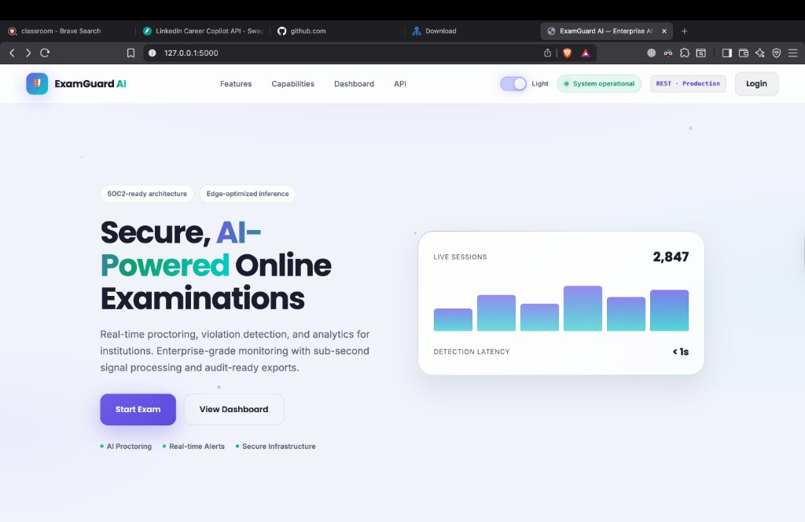
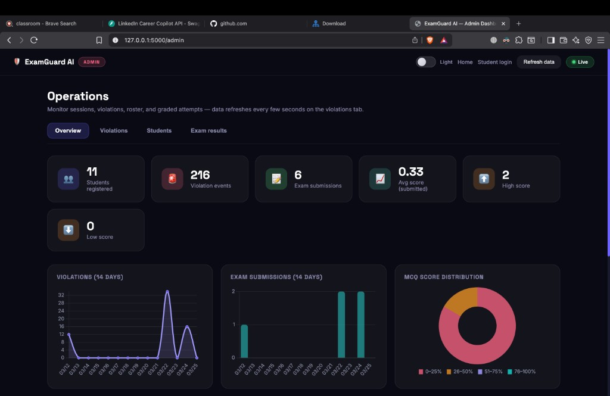
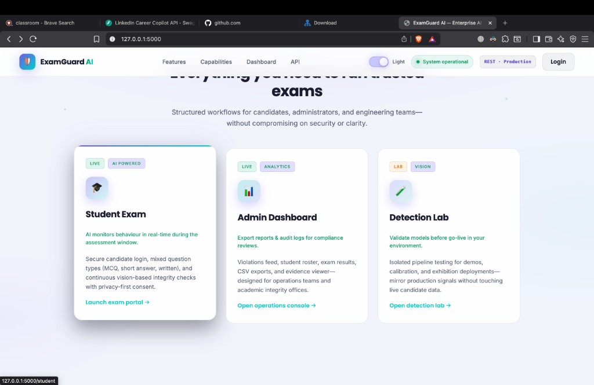

# ExamGuard AI

Enterprise-style **AI-powered online exam proctoring**: secure assessments, real-time integrity signals, admin analytics, and optional email alerts.

## Repository

| | |
|---|---|
| **GitHub** | [**akshat-collab / ExamGuradAi**](https://github.com/akshat-collab/ExamGuradAi) |
| **Clone** | `git clone https://github.com/akshat-collab/ExamGuradAi.git` |

After cloning, your project folder is **`ExamGuradAi`**. Use that path in the commands below instead of `project_exhibition` if you are working from GitHub.

---

## Screenshots

| Landing (light theme) — hero | Admin — Overview (dark) |
|:---:|:---:|
|  |  |

| Platform — feature cards (light) |
|:---:|
|  |

*Use the **Light** toggle in the nav (or header on exam/admin) to switch themes. Preference is saved in the browser (`localStorage`).*

---

## Highlights

- **Marketing home** (`/`) — SaaS-style landing: hero, capabilities, dashboard preview, trust strip, footer.
- **Student flow** (`/student` → `/exam`) — registration login, **privacy & proctoring notice** (required checkboxes), **MCQ + short answer + written** items, webcam monitoring, timer, security restrictions (with paste allowed in text answers).
- **Admin** (`/admin`) — Overview **KPIs + Chart.js** (violations & submissions over 14 days, score distribution, top violation types); tabs for **Violations**, **Students**, **Exam results**; per-row **delete**; **clear table** / **purge all** data (with typed confirmation); CSV export; evidence viewer.
- **Detection lab** (`/test`) — isolated vision pipeline demo.
- **API** — `GET /api/health`, `GET /api/dashboard`, `GET /api/admin/analytics`, roster/results JSON, etc.

---

## Quick start

### 1. Dependencies

```bash
cd ExamGuradAi    # or: cd project_exhibition (local copy)
python3 -m venv .venv
source .venv/bin/activate   # Windows: .venv\Scripts\activate
pip install -r requirements.txt
```

Heavy ML packages (TensorFlow, dlib, etc.) in `requirements.txt` are optional for a minimal run; core app needs at least **Flask**, **flask-cors**, **python-dotenv**, **OpenCV**, **numpy** (see `advanced_detector.py`).

### 2. Environment (optional email)

Copy `.env.example` → **`.env`** (gitignored):

```env
SENDER_EMAIL=your@gmail.com
SENDER_PASSWORD=your-gmail-app-password
RECEIVER_EMAIL=admin@gmail.com
SECRET_KEY=long-random-string-for-sessions
```

Aliases: `EXAMGUARD_EMAIL`, `EXAMGUARD_EMAIL_PASSWORD`, `EXAMGUARD_ALERT_EMAIL`.

Use a [Gmail App Password](https://myaccount.google.com/apppasswords) (2-Step Verification required). Without `.env`, the app runs but **skips SMTP**.

### 3. Run

```bash
python app.py
```

| URL | Purpose |
|-----|---------|
| http://127.0.0.1:5000/ | Landing & entry points |
| http://127.0.0.1:5000/student | Candidate login |
| http://127.0.0.1:5000/exam | Exam (after login) |
| http://127.0.0.1:5000/admin | Operations dashboard |
| http://127.0.0.1:5000/test | Detection lab |
| http://127.0.0.1:5000/api/health | JSON health check |

---

## Technology stack

| Layer | Stack |
|-------|--------|
| UI | HTML, CSS (`style.css`, `landing.css`, `theme.css`), vanilla JS |
| Backend | Flask, SQLite |
| Vision | OpenCV, custom `advanced_detector` (DNN / cascades when models present) |
| Charts | Chart.js (admin overview) |
| Email | SMTP (Gmail-compatible) |

---

## Security & proctoring (student exam)

- Webcam frames analyzed server-side; **snapshots** may be stored under `violations/` on flags.
- Tab visibility, focus loss, blocked shortcuts, right-click, etc. logged as security events.
- **Privacy gate** before the exam documents camera, AI analysis, logging, and answer storage.
- **Admin has no authentication** in this demo — do **not** expose `/admin` publicly without adding login / network controls.

---

## Admin data management

- Delete individual **violations** (removes DB row + evidence file when applicable), **students**, or **exam results**.
- **Clear all** per table (typed confirmation) or **Purge all platform data** (`PURGE_ALL_EXAMGUARD_DATA`) — irreversible.

---

## AI / integrity signals

Examples of what the pipeline can flag (depends on configuration and models):

- Multiple faces or no face in frame  
- Head pose / lighting heuristics  
- Combined with browser-side **tab switch** and similar events  

---

## Docs in repo

- `EMAIL_SETUP.md` — SMTP / Gmail notes  
- `SECURITY_FEATURES.md`, `AI_MODEL_INFO.md`, `INSTALL_ADVANCED.md` — deeper technical detail  

---

## License / use

Use and harden for your institution’s policies (privacy, retention, access control). Replace placeholder branding and contact emails on the landing page for production.

### Push updates to GitHub (`main`)

From your local clone of [ExamGuradAi](https://github.com/akshat-collab/ExamGuradAi) (after copying in this `README.md`, `docs/screenshots/`, and any code changes):

```bash
git checkout main
git add README.md docs/screenshots/
git status
git commit -m "docs: refresh README with screenshots and ExamGuard AI overview"
git push origin main
```

Add other modified files to `git add` as needed. Ensure **`docs/screenshots/*.png`** is committed so images render on GitHub.
